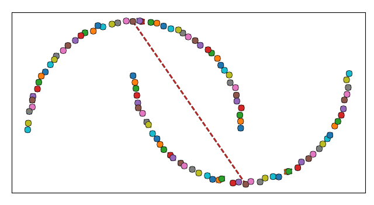

# Constrained Mean Shift Clustering

This is the official implementation of [*Constrained Mean Shift Clustering*](http://www.tnt.uni-hannover.de/papers/data/1553/CMS.pdf).



Constrained Mean Shift (CMS) is a novel approach for mean shift clustering under sparse supervision 
using cannot-link constraints. The constraints provide a guidance in constrained clustering 
indicating that the respective pair should not be assigned to the same cluster. 
Our method introduces a density-based integration of the constraints to generate individual 
distributions of the sampling points per cluster. We also alleviate the (in general very sensitive) 
mean shift bandwidth parameter by proposing an adaptive bandwidth adjustment which is especially 
useful for clustering imbalanced data sets.
约束均值偏移 (CMS) 是一种使用无法链接约束在稀疏监督下进行均值偏移聚类的新颖方法。这些约束提供了约束聚类的指导，指示不应将相应的对分配到同一聚类。我们的方法引入了基于密度的约束集成，以生成每个簇的采样点的单独分布。我们还通过提出自适应带宽调整来减轻（通常非常敏感）均值漂移带宽参数，这对于聚类不平衡数据集特别有用

## Brief Usage

Given some data points and some binary cannot link constraints:
给定一些数据点和一些二元不能链接约束：

```python
from sklearn.datasets import make_moons

# Generate moons data set
x, y = make_moons(shuffle=False)
# Create one cannot-link constraint from center of one moon to another
cl = [[25, 75]]
```

CMS can be invoked similar to sklearn cluster methods:
CMS可以像sklearn集群方法一样调用：

```python
from CMS import CMS, AutoLinearPolicy

# Create bandwidth policy as used in our experiments
pol = AutoLinearPolicy(x, 100)
# Use nonblurring mean shift (do not move sampling points)
cms = CMS(pol, max_iterations=100, blurring=False)
cms.fit(x, cl)
```

The `cms` object now contains the following members:
`cms` 对象现在包含以下成员：

Member | Description
--- | ---
`labels_` | Final cluster labels
`modes_` | Final position of the cluster centers/modes
`bandwidth_history_` | Bandwidths used per iteration
`mode_history_` | Cluster centers/modes per iteration
`kernel_history_` | Kernel weights per iteration
`block_history_` | Attraction reduction per iteration

To visualize the results, we provide a convenient Matplotlib routine:
```python
from CMS.Plotting import plot_clustering
import matplotlib.pyplot as plt

plot_clustering(x, cms.labels_, cms.modes_, cl=cl)

plt.show()
```

You can run [example_moons.py](example_moons.py) to try it yourself. You may also try adjusting the parameters of CMS:
您可以运行 [example_moons.py](example_moons.py) 自行尝试。您也可以尝试调整CMS的参数：

Parameter | Description
--- | ---
``h`` | Set the bandwidth either to a scalar float value, or a callable ``f(int) -> float`` returning the bandwidth for the given iteration
``max_iterations`` | Maximum number of iterations
``blurring`` | If ``True`` use blurring mean shift, i.e. the sampling points are updated with the cluster centers after each iteration, thus blurring them in the process. If ``False`` use nonblurring mean shift, where sampling points remain stationary.
``kernel`` | If ``'ball'``, use a ball kernel, otherwise expects a float in range [0, 1) to use as truncation of a truncated Gaussian kernel. Thus setting ``kernel=0.`` uses a regular Gaussian kernel.
``c_scale`` | The constraint scaling parameter that determines the spatial influence of constraints. For lower values, constraints have less reducing influence on far attractions.
``label_merge_k`` | This implementation of CMS uses connected components to determine the final cluster labels from the final cluster centers. Specifies the minimum closeness in terms of kernel value to merge two cluster centers into one cluster.
``label_merge_b`` | Specifies the lowest weight reduction through constraints below which two cluster centers are never merged. Set to ``0.`` to disable.
``use_cuda`` | If ``True``, use the CUDA Toolkit to accelerate some calculations. You must have the CUDA Toolkit installed. Please consult the official CUDA documentation on how to install CUDA for your specific system.


## Installation

### Pip

To use Constrained Mean Shift (CMS) as a library, we provide easy installation through pip. Simply run
为了使用 Constrained Mean Shift (CMS) 作为库，我们通过 pip 提供简单的安装。只需运行
```
python -m pip install git+https://github.com/m-schier/cms
```
### Manual installation
Alternatively, you may clone this repository and install from the local folder
或者，您可以克隆此存储库并从本地文件夹安装
```
git clone git@github.com:m-schier/cms.git
cd cms
python -m pip install .
```

### Local

To run the experiments, it is not required to install CMS through pip. In this case you can create a Conda environment with the required dependencies by running the following commands. This will install most dependencies with the exact version used during out experiments.
要运行实验，不需要通过 pip 安装 CMS。在这种情况下，您可以通过运行以下命令来创建具有所需依赖项的 Conda 环境。这将使用实验期间使用的确切版本安装大多数依赖项。
```shell
conda create --name cms python=3.8
conda activate cms
pip install -r requirements.txt
```
## Experiments

### Synthetic Data

First, you must download the used synthetic data sets by running `./download_synth.sh`. To evaluate performance of CMS on the synthetic data sets, run `python cluster_synth.py --data <DATA>`, where `<DATA>` is one of `moons`, `jain`, `s4`, or `aggregation`, e.g., 
首先，您必须通过运行“./download_synth.sh”下载使用的合成数据集。要评估 CMS 在合成数据集上的性能，请运行“python cluster_synth.py --data <DATA>”，其中“<DATA>”是“moons”、“jain”、“s4”或“aggregation”之一，例如，
```shell
python cluster_synth.py --data aggregation
```


### Image Data

To evaluate performance on the pretrained image embeddings used in our work, run `python cluster_img.py --data <DATA>`, where `<DATA>` is one of the image data sets `mnist`, `fashion-mnist`, or `gtsrb`, e.g., 
要评估我们工作中使用的预训练图像嵌入的性能，请运行“python cluster_img.py --data <DATA>”，其中“<DATA>”是图像数据集“mnist”、“fashion-mnist”之一，或 `gtsrb`，例如，
```shell
python cluster_img.py --data gtsrb
```

To train a stacked denoising auto encoder and save its image embeddings, run `python pretrain.py --data <DATA>`.
要训​​练堆叠式去噪自动编码器并保存其图像嵌入，请运行“python pretrain.py --data <DATA>”。
In order to train on GTSRB, you must first download the GTSRB training data set by running `./download_gtsrb.sh`.
为了在 GTSRB 上进行训练，您必须首先通过运行“./download_gtsrb.sh”下载 GTSRB 训练数据集。

